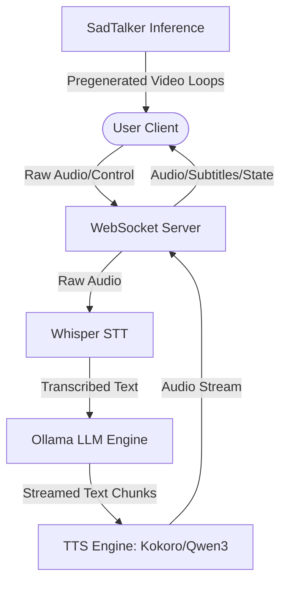
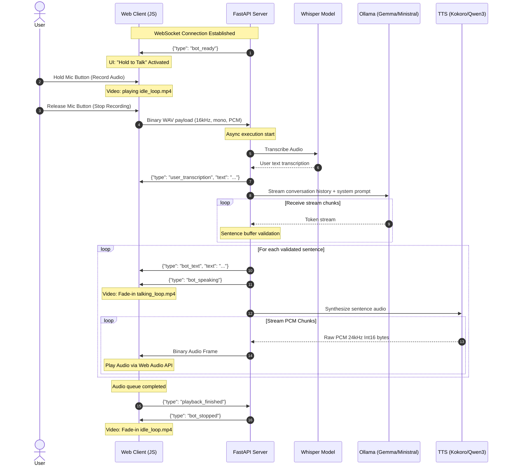

# MultiModal Offender Persona Twin: OffenderInteraction Design

This document describes the architecture, protocols, and sequential data flows of the **OffenderInteraction** design used in the MultiModal Offender Persona Twin application.

---

## 1. Overview
The OffenderInteraction system enables real-time, low-latency, multimodal interactions (Voice + Video + Text) with virtual AI twins. It features a conversational loop utilizing local speech recognition, LLM generation, speech synthesis, and deep-learning-based avatar video generation.

---

## 2. Interaction Loop Architecture

The system utilizes a client-server push-model over a single stateful **WebSocket** connection (`/ws/chat/{persona_id}`) to minimize protocol overhead and support low-latency full-duplex communication.

### Phase 1: Persona Creation and Video Setup
Before interaction can begin, the system pre-generates the animation files for the chosen persona:
1. **User Uploads Image and Prompts**: The persona is registered with a system prompt and reference face photo.
2. **Background Video Generation**:
   - The server launches **SadTalker** as an asynchronous background task.
   - It renders an **Idle Loop Video (`idle_loop.mp4`)** (driven by a silent/breath audio reference).
   - It renders a **Talking Loop Video (`talking_loop.mp4`)** (driven by a sample speech track).
3. **Ready State**: The persona status transitions to `ready`, making the twin available for conversation.

### Phase 2: Live Interaction (WebSocket Flow)

---

## 3. Subsystem Specifications

### 1. Automatic Speech Recognition (STT)
- **Model**: OpenAI's Whisper (`base` model).
- **Processing**: The raw audio bytes are received as WAV format over the WebSocket, dumped to a lightweight local temporary file, and processed within a Python thread pool to prevent blocking the async application event loop.

### 2. Large Language Model (LLM)
- **Engine**: Ollama local inference.
- **Model Resolution**:
  - Automatically probes Ollama API (`/api/tags`) and resolves availability in the following order: `gemma` -> `ministral-3:3b` -> `deepseek-r1:8b` -> first available model.
- **Prompt Isolation**: System instructions/persona profiles are passed as `system` role messages at the head of the conversational array.

### 3. Text-to-Speech (TTS)
- **Preset Voice Mode**: Powered by **Kokoro ONNX**. High-performance CPU synthesis with sub-sentence streaming.
- **Custom Cloned Voice Mode**: Powered by **Qwen3-TTS 0.6B Base**. Performs voice cloning by referencing the user-provided sample audio file and transcribing its text profile.
- **Output Encoding**: Raw Int16 PCM samples at `24,000Hz` sample rate.

### 4. Interactive Video Animation (SadTalker)
- **Model**: SadTalker (driven by Wav2Lip/first-order motion models).
- **Optimized Video Loops**:
  - Instead of generating video frames dynamically (which is computationally expensive and introduces high latency), the system pre-generates high-fidelity MP4 loops.
  - The client UI transitions between `idle_loop.mp4` and `talking_loop.mp4` with a CSS transition layer (`opacity 0.2s ease-in-out`), yielding a seamless, real-time animation experience.

---

## 4. Crucial Interruption Design

A key design highlight of the OffenderInteraction model is **real-time user interruption**. If a user starts speaking while the twin is mid-speech:

1. **Client Event**: When the user presses the microphone button, the client immediately executes `interruptPlayback()`. This clears the audio playback queue and resets the local AudioContext.
2. **Server Message**: The client transmits an `interrupt` signaling event or immediately begins sending new binary audio.
3. **Execution Break**:
   - The backend catches the interruption request via an `asyncio.Event` flag (`self._interrupt_event`).
   - The active speech/LLM generation thread task is aborted using `self.speech_task.cancel()`.
   - The ongoing LLM stream and audio generation are truncated immediately, readying the server for the next input without queue blocking.

---

## 5. WebSocket Protocol Reference

### Client -> Server Messages
- **Binary Data**: `Blob` containing 16kHz mono WAV audio recording.
- **JSON Signals**:
  - `{"type": "interrupt"}`: Signals immediate halt of all bot output.
  - `{"type": "playback_finished"}`: Signals that the client-side audio playback queue is exhausted.

### Server -> Client Messages
- **Binary Data**: Raw `24kHz` mono `Int16` PCM audio chunks (for TTS playback).
- **JSON Signals**:
  - `{"type": "bot_ready"}`: Handshake confirming models are loaded and connection is ready.
  - `{"type": "user_transcription", "text": "..."}`: Real-time STT feedback of user speech.
  - `{"type": "bot_text", "text": "..."}`: The text content of the sentence currently being spoken.
  - `{"type": "bot_speaking"}`: Alert to transition video element to the `talking_loop`.
  - `{"type": "bot_stopped"}`: Alert to transition video element to the `idle_loop`.
