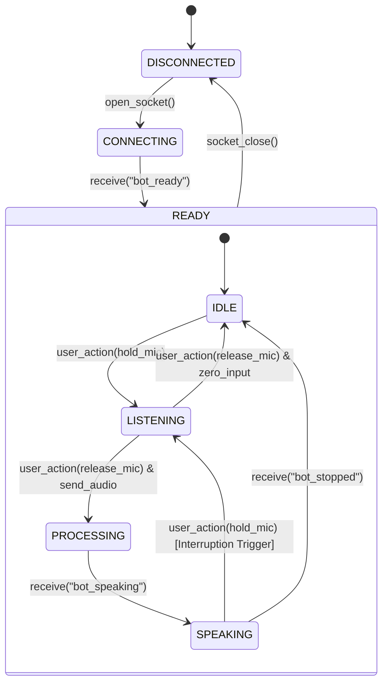

# MultiModal Offender Persona Twin: OffenderInteraction  Specification

specification for the `OffenderInteraction` subsystem. Implementation must validate against these exact interfaces, schemas, states, and behavior requirements.

---

## 1. Domain Scope & Interface Boundaries

The `OffenderInteraction` subsystem manages the real-time, low-latency conversation session between a user client and a target persona twin. It isolates STT, LLM, TTS, and video loop transition states behind a uniform event-driven state interface.

---

## 2. Protocol Interface Specifications

All communication occurs over a stateful WebSocket endpoint: `/ws/chat/{persona_id}`.

### 2.1 Server-Bound Message Schema (Client -> Server)

#### A. Voice Payload (Binary Frame)
*   **Format**: Raw WAV container containing `PCM 16-bit Mono` audio sampled at `16,000 Hz`.
*   **Trigger**: Sent immediately when the user finishes recording (releases input interaction).
*   **Action**: Backend must write the bytes to a temp file and trigger the STT parser immediately, aborting any active speaker tasks.

#### B. Control Messages (Text Frame JSON)
All text frames must be valid JSON objects conforming to the following structure:

```json
{
  "$schema": "http://json-schema.org/draft-07/schema#",
  "type": "object",
  "properties": {
    "type": {
      "type": "string",
      "enum": ["interrupt", "playback_finished"]
    }
  },
  "required": ["type"]
}
```

*   **`interrupt`**: Halts downstream audio generation and LLM context streaming immediately.
*   **`playback_finished`**: Notifies the backend that the client has completed output playback and is back in an idle state.

---

### 2.2 Client-Bound Message Schema (Server -> Client)

#### A. Voice Streaming Payload (Binary Frame)
*   **Format**: Raw, headerless PCM `16-bit Mono` audio chunks sampled at `24,000 Hz`.
*   **Buffer Size**: Up to 8192 bytes per socket transmission.

#### B. Status & Content Streams (Text Frame JSON)

##### 1. Handshake Ready
Sent when the persona's models are fully loaded and active.
```json
{
  "type": "bot_ready"
}
```

##### 2. User Transcription (ASR Feedback)
Sent as soon as the user's speech audio is converted to text.
```json
{
  "type": "user_transcription",
  "text": "The transcribed user speech content."
}
```

##### 3. Twin Sentence Stream (Text Subtitles)
Sent before streaming corresponding audio samples to allow text synchronization.
```json
{
  "type": "bot_text",
  "text": "The sentence currently being synthesized."
}
```

##### 4. State Transitions
Notifies the client to swap video assets or update visual status indicators.
*   **Start Speaking**:
    ```json
    { "type": "bot_speaking" }
    ```
*   **Stop Speaking / Idle**:
    ```json
    { "type": "bot_stopped" }
    ```

---

## 3. Interactive State Machine

The client and server coordinate across four distinct operational states:



### State Definitions & Behavior Constraints

| State | Context | Trigger Event | Resulting Action |
| :--- | :--- | :--- | :--- |
| **IDLE** | Client playing `idle_loop.mp4` (muted). | User presses Mic Button. | Transition to **LISTENING**. |
| **LISTENING** | Client capturing media stream. | User releases Mic Button. | Transition to **PROCESSING**; compile/send WAV. |
| **PROCESSING** | Backend running STT / LLM inference. | Backend finishes first sentence synthesis. | Stream `bot_speaking` event; Transition to **SPEAKING**. |
| **SPEAKING** | Client playing `talking_loop.mp4` & streaming audio. | User presses Mic Button (Interruption). | Send `interrupt`; stop audio playback; Transition to **LISTENING**. |

---

## 4. Interruption Sequence Specification

If a user interrupts while the twin is generating or speaking, the sequence must execute in the following priority order:

1.  **Immediate Client-Side Stop**: Client suspends active Web Audio playback buffers, clears `audioQueue`, and flags `isPlaying = false`.
2.  **Socket Signaling**: Client sends the `interrupt` JSON payload (or immediately streams new user audio, which acts as an implicit interrupt).
3.  **Task Cancellation**:
    *   Backend intercepts the signal via its active runner (`asyncio.Event`).
    *   The backend runs task cancellation on the generator task: `self.speech_task.cancel()`.
    *   Ollama HTTP stream handles are closed, and Kokoro/Qwen ONNX streams are immediately disposed of.
4.  **Recycled State**: The interface resets to the **LISTENING** state.

---

## 5. Verification & Test Plan

### 5.1 Automated Unit Tests
*   **Schema Validation**: Ensure all server-generated text messages validate against the schemas listed in Section 2.2.
*   **Audio Format Validation**: Write assertions verifying that generated binary TTS chunks are valid `24,000 Hz` sample-rate PCM arrays.
*   **Interruption Assertions**: Mock the LLM output stream to produce infinite tokens, trigger a simulated `interrupt` signal mid-stream, and assert that the LLM response handler task receives `asyncio.CancelledError` and terminates immediately.

### 5.2 Manual Verification Sequence
1.  **Visual Alignment**: Verify that the transition between `idle_loop.mp4` and `talking_loop.mp4` happens within <300ms of the state transition indicators (`bot_speaking`, `bot_stopped`).
2.  **Audio Sync**: Verify that the audio stream starts audible playback within 100ms of the client receiving `bot_text` subtitles.
3.  **Multi-sentence Loop**: Confirm that response sentences are streamed dynamically (sentences are played one after another without waiting for the entire LLM generation to complete).
